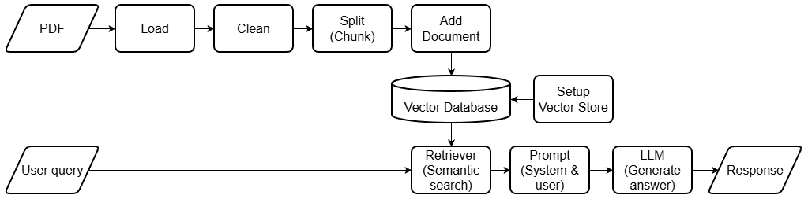

# Assignment: Intelligent Customer Assistant System

## Stack:
1. Runtime: Python 3.13.
2. Vector database: Qdrant.
3. PDF extractor: PyMuPDF.
4. Embedding model: all-mpnet-base-v2.
5. LLM model: gemini-2.5-flash.
6. Backend: FastAPI.
7. Interface: Streamlit.

## Prerequisites:
1. Gemini API key from: https://aistudio.google.com/

## Setup:
1. `git clone https://github.com/RifqiAnshariR/rag-langchain.git`
2. `cd rag-langchain`
3. `py -3.13 -m venv .venv` and activate it `.venv\Scripts\activate`
4. `pip install -r requirements.txt`
5. Make .env file contains: GOOGLE_API_KEY.

## How to run:
1. To run api: `python main.py`
2. To run Streamlit: `streamlit run app.py`

## Flowchart:
